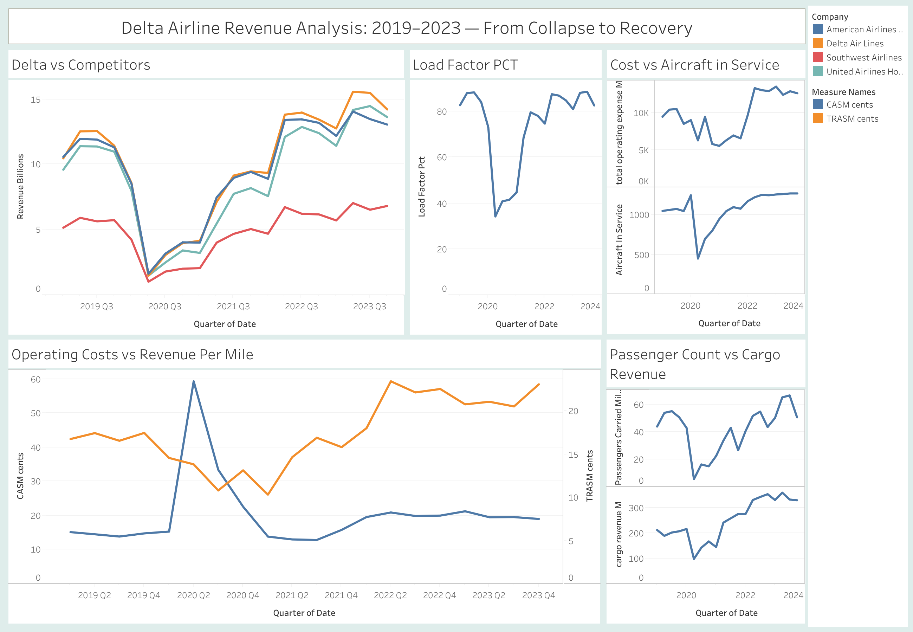

# Delta-Airlines-Financial-Analysis-2019-2023

## Project background

The COVID-19 pandemic caused the most severe disruption in commercial aviation history. Between 2019 and 2020, Delta Air Lines saw revenue fall from $47 billion to $17 billion — a 64% collapse in a single year. This project goes beyond the headline numbers to identify the operational and financial drivers behind both the crash and the subsequent recovery.

Rather than simply tracking revenue over time, this analysis examines the *why*: how fuel costs, load factor, aircraft utilization, workforce size, and revenue mix each contributed to Delta's financial trajectory from 2019 through 2023.

---

## Data Sources

All data sourced from official public filings and government databases:

| Source | Data Retrieved | Link |
|---|---|---|
| SEC EDGAR — Delta 10-K Filings | Annual revenue, costs, operating stats (2019–2023) | [EDGAR](https://www.sec.gov/cgi-bin/browse-edgar?action=getcompany&CIK=0000027904&type=10-K) |
| SEC EDGAR — Delta 10-Q Filings | Quarterly revenue breakdown, cost line items (Q1–Q3 each year) | [EDGAR](https://www.sec.gov/cgi-bin/browse-edgar?action=getcompany&CIK=0000027904&type=10-Q) |
| Bullfincher.io | Cross-reference for quarterly revenue (UAL, DAL, AAL, LUV) | [Bullfincher](https://bullfincher.io) |

> **Note:** Q4 figures for each year are derived values — calculated as the full-year annual total (from 10-K) minus the sum of Q1+Q2+Q3 (from 10-Q filings). All derived figures are flagged in the `data_source` column of each dataset.

---

## Dashboard

The dashboard is structured across five analytical sheets:

1. **Industry Comparison** — Revenue and net income across Delta, United, American and Southwest 2019–2023
2. **Cost Per Mile vs. Revenue** — Delta CASM and CASM-ex vs. TRASM, showing when the airline was flying above or below its cost floor
3. **Load Factor Analysis** — Seat utilization over time and its relationship to profitability
4. **Aircraft in Service vs. Operating Costs** — Fleet utilization as a driver of fixed cost absorption
5. **Passengers Carried vs. Cargo Revenue** — How cargo partially offset passenger revenue collapse during COVID

---

## Key Findings

- **Q2 2020 was the floor:** Delta carried only 5.6 million passengers, down from 54 million in Q2 2019 — a 90% collapse in a single quarter
- **Costs don't fall as fast as revenue:** Salaries, depreciation and landing fees remained largely fixed even as revenue evaporated, pushing CASM to 59¢ in Q2 2020 vs. 14.5¢ in Q2 2019
- **Cargo was a quiet cushion:** Cargo revenue held at $98–$142M through the worst COVID quarters while passenger revenue fell 83%, as belly freight demand surged with grounded dedicated freighters
- **Premium recovered faster than main cabin:** By Q3 2022, premium ticket revenue had exceeded 2019 levels while main cabin was still catching up — a structural shift in Delta's revenue mix
- **The fuel shock of 2022 nearly erased the recovery:** Despite revenue returning to 2019 levels by Q2 2022, net income was only $1.3B for the full year as fuel hit $3.74/gallon — up from $2.02 in 2019
- **Load factor as the leading indicator:** Load factor recovery consistently preceded revenue recovery by 1–2 quarters, making it the best early signal of financial improvement

---

## Executive Summary

Delta Air Lines: Pandemic Collapse and Recovery Analysis (2019–2023)
This analysis utilizes SEC 10-K/10-Q filings to examine Delta’s financial performance and recovery, offering a granular look at how the airline navigated the COVID-19 pandemic compared to other major U.S. carriers.

The Collapse (2020)
Revenue Impact: Total operating revenue plummeted 64%, falling from $47 billion to $17.1 billion.

Operational Hitting: Q2 2020 passenger volume crashed from 54 million to 5.6 million, resulting in a $4.8 billion single-quarter operating loss.

Cost Inelasticity: Operating costs remained largely fixed despite the revenue void; cost-per-available-seat-mile (CASM) spiked from 14.5 cents to 59 cents in Q2 2020.

Key Recovery Drivers
Load Factor as a Leading Indicator: Improvements in load factor consistently signaled financial recovery one to two quarters before revenue followed suit.

Cargo Buffering: Cargo revenue provided a critical cushion during the passenger demand collapse, supported by surging demand for belly freight.

Fleet Utilization: Strategic fleet management was essential for absorbing fixed costs as capacity was gradually restored.

Post-Pandemic Challenges
Profitability Lag: Although revenue returned to 2019 levels by mid-2022, full profitability was delayed.

External Shocks: The Russia-Ukraine war proved to be the primary recovery hurdle, driving fuel costs to $3.74 per gallon.

Methodological Note: Delta was selected for this study due to the superior granularity of its operational reporting compared to American, United, or Southwest. The study incorporates a comparative dataset of all four major U.S. carriers to provide industry-wide context.

